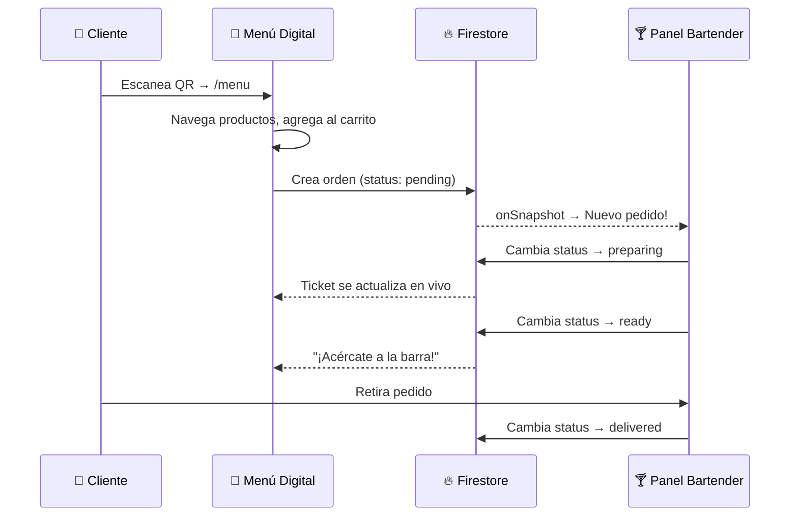

# 🌊 Flow Bar

**Plataforma de pedidos digitales para bares y boliches.** Un sistema integral en tiempo real que conecta a los clientes con la barra, eliminando filas y optimizando la operación. Diseñado con una estética retro-futurista CRT que combina nostalgia con tecnología moderna.

---

## 🎯 Visión

Flow Bar busca eliminar las filas en bares con alta concurrencia permitiendo pedidos digitales vía **códigos QR**. El _core_ del sistema es la **sincronización en tiempo real** entre el cliente y la barra utilizando Firebase Firestore.

---

## 🚀 Funcionalidades

### 🍹 Carta Digital (Cliente)
- **Acceso por QR**: Escaneo de código QR en la mesa o barra que abre `/menu`.
- **Menú Interactivo**: Visualización de tragos, precios, imágenes y categorías con animaciones fluidas (Framer Motion).
- **Carrito Inteligente**: Gestión de productos con persistencia en `localStorage` (resistente a recarga/desconexión).
- **Checkout Rápido**: Proceso de compra simplificado con feedback visual de éxito.
- **Comprobante Digital**: Ticket electrónico con estética CRT accesible vía `/menu/order/:id`.
- **Seguimiento en Vivo**: El estado del pedido (En Cola → Cocina → ¡Listo! → Entregado) se actualiza en tiempo real directamente en el ticket.
- **Historial Local**: Los pedidos del cliente se guardan localmente y se pueden consultar en cualquier momento durante la sesión.

### 📋 Panel de Barra (Bartender)
- **Pedidos en Tiempo Real**: Notificaciones instantáneas al recibir un nuevo pedido vía `onSnapshot`.
- **Gestión de Estados**: Flujo de preparación (Pendiente → Preparando → Listo → Entregado).
- **Comunicación en Vivo**: Sistema de chat integrado para coordinación del equipo.

### 🔐 Panel de Administración
- **Dashboard**: Vista general de ventas activas, pedidos totales y turnos actuales con métricas formateadas.
- **Gestión de Menú**: CRUD completo de productos, precios, imágenes y categorías.
- **Personal**: Administración de usuarios (roles Admin/Bartender).
- **Control de Caja**: Apertura/cierre de jornadas con resumen de ventas, pedidos entregados y tiempo transcurrido.
- **Historial de Turnos**: Registro detallado de cada jornada con desglose de pedidos individuales.
- **Historial de Pedidos**: Auditoría completa de todas las órdenes procesadas.

---

## 🛠️ Stack Tecnológico

| Capa | Tecnología |
|---|---|
| **Framework** | [React 19](https://react.dev/) (JavaScript) |
| **Bundler** | [Vite](https://vite.dev/) |
| **Estilos** | [Tailwind CSS 4](https://tailwindcss.com/) |
| **Animaciones** | [Framer Motion](https://www.framer.com/motion/) |
| **Iconos** | [Lucide React](https://lucide.dev/) |
| **Routing** | [React Router Dom 7](https://reactrouter.com/) |
| **Base de Datos** | [Firebase Cloud Firestore](https://firebase.google.com/) (Realtime NoSQL) |
| **Autenticación** | [Firebase Auth](https://firebase.google.com/products/auth) |

---

## 📂 Estructura del Proyecto

```text
flow-bar/
├── public/                     # Activos estáticos (favicon, 404.html)
├── doc/                        # Documentación del proyecto
│   ├── Proyecto Flow Bar.md    # Visión general y módulos
│   ├── Estructura.md           # Organización de carpetas
│   ├── Firestore.md            # Modelo de datos y reglas de seguridad
│   ├── Guia_Construccion.md    # Hoja de ruta del MVP
│   └── resumen.md              # Stack y flujos consolidados
├── src/
│   ├── app/                    # Configuración global
│   │   ├── App.jsx             # Componente raíz
│   │   └── router.jsx          # Definición de rutas (React Router)
│   │
│   ├── assets/                 # Imágenes y fuentes
│   │
│   ├── components/             # Componentes reutilizables
│   │   ├── admin/              # Componentes del panel admin
│   │   ├── layout/             # Navbar, Sidebar, ProtectedRoute
│   │   ├── orders/             # CartOverlay, OrderHistory
│   │   ├── products/           # ProductCard, listas de menú
│   │   └── ui/                 # Button, Badge, Modal, Toast (genéricos)
│   │
│   ├── context/                # Estados globales
│   │   ├── AuthContext.jsx     # Autenticación y datos del usuario
│   │   └── ToastContext.jsx    # Sistema de notificaciones
│   │
│   ├── hooks/                  # Custom React hooks
│   │
│   ├── pages/                  # Vistas principales
│   │   ├── menu/               # Vista Cliente
│   │   │   ├── MenuPage.jsx    #   Menú, carrito y checkout
│   │   │   └── OrderReceipt.jsx#   Comprobante digital (ticket)
│   │   ├── bar/                # Vista Bartender
│   │   │   └── BarPage.jsx     #   Gestión de pedidos en vivo
│   │   └── admin/              # Vista Administrador
│   │       ├── AdminPage.jsx   #   Layout con sidebar
│   │       ├── AdminDashboard.jsx  # Métricas y estadísticas
│   │       ├── AdminProducts.jsx   # CRUD de productos
│   │       ├── AdminCategories.jsx # CRUD de categorías
│   │       ├── AdminPersonal.jsx   # Gestión de staff
│   │       ├── AdminHistory.jsx    # Historial de pedidos
│   │       ├── AdminShifts.jsx     # Control de caja/jornadas
│   │       ├── ShiftDetails.jsx    # Detalle de una jornada
│   │       └── LoginPage.jsx       # Inicio de sesión
│   │
│   ├── services/               # Comunicación con Firebase
│   │   ├── firebase.js         # Inicialización de Firebase
│   │   ├── auth.js             # Login / Logout
│   │   ├── products.js         # CRUD de productos
│   │   ├── categories.js       # CRUD de categorías
│   │   ├── orders.js           # Lógica de pedidos y suscripciones
│   │   ├── shifts.js           # Gestión de jornadas/turnos
│   │   ├── storage.js          # Persistencia local (localStorage)
│   │   └── users.js            # Gestión de usuarios/staff
│   │
│   ├── styles/
│   │   └── index.css           # Tailwind, animaciones y @media print
│   │
│   ├── utils/
│   │   └── format.js           # formatARS (formato de moneda argentina)
│   │
│   └── main.jsx                # Punto de entrada
│
├── .env                        # Variables de entorno (Firebase Keys)
├── index.html
├── package.json
└── vite.config.js
```

---

## 🔥 Modelo de Datos (Firestore)

Estructura plana para máxima velocidad y consultas cruzadas simples.

| Colección | Descripción | Campos Clave |
|---|---|---|
| `products` | Menú digital | `name`, `price`, `category`, `image`, `active` |
| `categories` | Clasificación de productos | `name`, `order` |
| `orders` | Pedidos (Núcleo) | `items[]`, `total`, `status`, `shiftId`, `createdAt` |
| `users` | Staff (Admin/Bartender) | `email`, `role`, `active` |
| `shifts` | Control de caja | `openedBy`, `openedAt`, `closedAt`, `totalRevenue` |

### Flujo de Estados de Pedidos
```
pending → preparing → ready → delivered
```
> **Desnormalización**: Se duplican `name` y `price` dentro del array `items` de cada orden para preservar el precio cobrado aunque el producto cambie de precio en el futuro.

---

## 🔄 Flujo Principal (Happy Path)



---

## 📦 Inicio Rápido

### Requisitos
- Node.js v18+
- Cuenta de Firebase

### Instalación

```bash
# 1. Clonar el repositorio
git clone https://github.com/tu-usuario/flow-bar.git
cd flow-bar

# 2. Instalar dependencias
npm install

# 3. Configurar variables de entorno
# Crear archivo .env en la raíz con:
```

```env
VITE_FIREBASE_API_KEY=tu_api_key
VITE_FIREBASE_AUTH_DOMAIN=tu_auth_domain
VITE_FIREBASE_PROJECT_ID=tu_project_id
VITE_FIREBASE_STORAGE_BUCKET=tu_storage_bucket
VITE_FIREBASE_MESSAGING_SENDER_ID=tu_sender_id
VITE_FIREBASE_APP_ID=tu_app_id
```

```bash
# 4. Iniciar el servidor de desarrollo
npm run dev

# 5. Build de producción
npm run build
```

---

## 🔐 Rutas de la Aplicación

| Ruta | Acceso | Descripción |
|---|---|---|
| `/menu` | 🌐 Público | Menú digital y carrito |
| `/menu/order/:id` | 🌐 Público | Comprobante/ticket de pedido |
| `/bar` | 🔒 Bartender | Panel de gestión de pedidos |
| `/admin` | 🔒 Admin | Dashboard administrativo |
| `/admin/products` | 🔒 Admin | Gestión de productos |
| `/admin/categories` | 🔒 Admin | Gestión de categorías |
| `/admin/personal` | 🔒 Admin | Gestión de personal |
| `/admin/history` | 🔒 Admin | Historial de pedidos |
| `/admin/shifts` | 🔒 Admin | Control de caja |
| `/admin/shifts/:id` | 🔒 Admin | Detalle de jornada |
| `/login` | 🌐 Público | Inicio de sesión |

---

## 🎨 Diseño

- **Estética**: Retro-futurista CRT con glassmorphism y alto contraste.
- **Paleta**: Fondo oscuro (`#121212`), primario rojo (`#ff4d4d`), acentos cyan y amarillo.
- **Tipografía**: Inter (system-ui fallback).
- **Animaciones**: Framer Motion con springs orgánicos para feedback táctil premium.
- **Mobile-First**: Diseñado primero para móviles, responsivo para tablets y desktop.
- **Accesibilidad**: HTML semántico, ARIA labels, contraste optimizado.
- **Impresión**: Estilos `@media print` para tickets de comprobante.

---

## 📜 Documentación

Documentación detallada disponible en la carpeta [`doc/`](doc/):

| Archivo | Contenido |
|---|---|
| [Proyecto Flow Bar.md](doc/Proyecto%20Flow%20Bar.md) | Visión general, módulos y funcionalidades clave |
| [Estructura.md](doc/Estructura.md) | Organización de carpetas y recomendaciones |
| [Firestore.md](doc/Firestore.md) | Modelo de datos, índices y reglas de seguridad |
| [Guia_Construccion.md](doc/Guia_Construccion.md) | Hoja de ruta y checklist del MVP |
| [resumen.md](doc/resumen.md) | Stack técnico y flujos consolidados |

---

## 📜 Licencia

Proyecto privado — Todos los derechos reservados.
